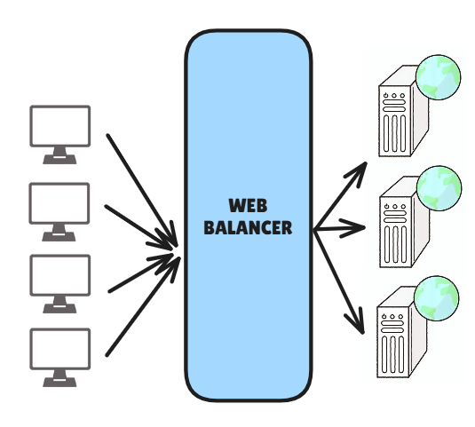

# How to Configure and Use Load Balancing with Nginx

## Introduction

To ensure optimal performance and high availability, large web applications often adopt **load balancing** strategies. This technique distributes traffic across multiple instances of an application to prevent overloads, reduce response times, and enhance resilience against failures.

In this tutorial, we will learn **how to configure Nginx to act as a load balancer** and route requests to multiple instances of a small backend developed in Node.js. To simplify deployment and environment management, we will use Docker to contain and orchestrate all the services.



## Files Architecture

```
project/
├── backend/
│   ├── server.js
│   ├── package.json
│   ├── Dockerfile
├── frontend/
│   ├── index.html
│   ├── Dockerfile
├── nginx/
│   ├── nginx.conf
│   ├── Dockerfile
├── docker-compose.yml
```

## Backend

First, we will start with the backend. The backend for this project is a small Node.js application designed to handle HTTP requests and provide specific information about the instance it belongs to. Each backend instance is configured to return a custom header identifying its name, allowing us to clearly observe how the load balancer distributes requests across instances.

First, we have this Dockerfile.

```Dockerfile
# The official Node.js image
FROM node:23

# Working directory
WORKDIR /app
COPY package*.json ./

# Install np dependencies
RUN npm install
COPY . .

# Expose port 3000 to allow external access to the application
EXPOSE 3000

# Command to start the application
CMD ["node", "server.js"]
```

This file allows us to containerize the Node.js applications. Next, we have the configuration files for our server.

```json
{
    "name": "backend",
    "version": "1.0.0",
    "main": "server.js",
    "scripts": {
        "start": "node server.js"
    },
    "dependencies": {
        "express": "^4.18.2"
    }
}
```

```Javascript
const express = require("express");
const app = express(); // App Init

const PORT = process.env.PORT;
const INSTANCE_NAME = process.env.INSTANCE_NAME; // The name of the instance (used to identify each backend)

// Main route that responds with the instance name and its port.
app.get("/", (req, res) => {
  res.send(`You are connected to ${INSTANCE_NAME} on port: ${PORT}`);
});


// Starting the server on the specified port
app.listen(PORT, () => {
  console.log(`${INSTANCE_NAME} running on port ${PORT}`);
});
```

This small Node.js application helps determine which backend instance the user is connected to.

## Frontend

Now we move on to the frontend. The frontend for this project provides a simple interface to interact with the backend instances. Designed as a static HTML page, it dynamically displays the information received from the backend, such as the instance name and the port in use.

``` HTML
<!DOCTYPE html>
<html lang="en">
<head>
  <meta charset="UTF-8">
  <meta name="viewport" content="width=device-width, initial-scale=1.0">
  <title>Load Balancing Example</title>
</head>
<body>
  <h1>Welcome to this Load Balancer exemple</h1>
  <p id="message">Connecting to backend...</p>

  <script>
    fetch("/") // Makes a GET request to the root route "/".
      .then(response => response.text())
      .then(data => {
        // Updates the paragraph content with the backend message.
        document.getElementById("message").innerText = data;
      })
      .catch(err => {
        // If the request fails, displays an error message.
        document.getElementById("message").innerText = "Failed to connect to backend.";
      });
  </script>
</body>
</html>
```

## Nginx

Now let’s discuss the most critical part of load balancing: the Nginx configuration. Nginx is a high-performance, open-source web server and reverse proxy widely used for managing and optimizing web traffic. In this project, Nginx acts as the load balancer, distributing client requests across multiple backend instances to ensure efficient resource usage, scalability, and reliability.

Here is the Dockerfile for Nginx:

``` Dockerfile
# Use the official alpine Nginx image as the base image
FROM nginx:alpine

# Copy the custom Nginx configuration file into the container
COPY nginx.conf /etc/nginx/nginx.conf

```

Next, the Nginx configuration file:

```nginx.conf
events {}

http {
  # Define a custom log format to include the target backend.
  log_format upstream_log '$remote_addr - $remote_user [$time_local] '
                          '"$request" $status $body_bytes_sent '
                          '"$http_referer" "$http_user_agent" '
                          'to: $upstream_addr instance: $upstream_http_x_instance_name';

  access_log /var/log/nginx/access.log upstream_log;

  # Define the backend servers as a load balancing group.
  upstream backend_servers {
    server backend1:3000; # Address of the first backend.
    server backend2:3000; # Address of the second backend.
    server backend3:3000; # Address of the third backend.
  }

  server {
    listen 80; # Le serveur écoute les requêtes HTTP sur le port 80.

    location / {
      proxy_pass http://backend_servers;  # Forwards requests to the backend server group.
    }
  }
}
```
The Nginx configuration defines how load balancing is performed across multiple backend instances. In this case, the upstream block groups three backend servers (Backend 1, Backend 2, Backend 3), each listening on port 3000. These servers are configured to receive requests via Nginx, acting as a reverse proxy.

The proxy_pass directive in the server section forwards incoming requests to the server group defined in the upstream block. By default, Nginx uses the round-robin strategy, meaning client requests are sent successively to each backend server in the order they are listed.

Docker
Finally, let’s look at the Docker configuration. Docker provides a solution to deploy and isolate the various services. Each component of the application—whether the Node.js backends or the Nginx reverse proxy—is encapsulated in its own Docker container.

``` docker-compose.yml
version: "3.9"

services:
  backend1: # Definition of the first backend instance.
    build:
      context: ./backend
    environment:
      - PORT=3000 # Sets the listening port inside the container.
      - INSTANCE_NAME=Backend-1 # Name of the instance for identification.

  backend2: # Definition of the second backend instance.
    build:
      context: ./backend
    environment:
      - PORT=3000 # Sets the listening port inside the container.
      - INSTANCE_NAME=Backend-2 # Name of the instance for identification.

  backend3: # Definition of the third backend instance.
    build:
      context: ./backend
    environment:
      - PORT=3000 # Sets the listening port inside the container.
      - INSTANCE_NAME=Backend-3 # Name of the instance for identification.

  nginx: # Definition of the Nginx service.
    build:
      context: ./nginx
    ports:
      - "80:80" # Maps port 80 of the host to port 80 of the container.
    depends_on: # The Nginx service depends on the backend services.
      - backend1
      - backend2
      - backend3
```

## Conclusion

This project demonstrates the efficiency and simplicity of a load balancing architecture with Nginx. It shows how to distribute the load across multiple backend instances. This solution can be easily adapted to more complex environments